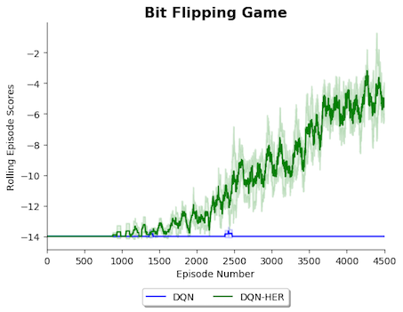
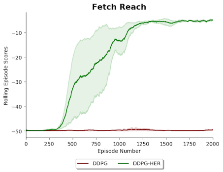

# Deep Reinforcement Learning Algorithms with PyTorch


   

This repository contains PyTorch implementations of deep reinforcement learning algorithms. 

## **Algorithms Implemented** 

1. Deep Q Learning (DQN) ([Mnih 2013](https://arxiv.org/pdf/1312.5602.pdf))  
1. DQN with Fixed Q Targets ([Mnih 2013](https://arxiv.org/pdf/1312.5602.pdf))
1. Double DQN ([Hado van Hasselt 2015](https://arxiv.org/pdf/1509.06461.pdf))
1. Double DQN with Prioritised Experience Replay ([Schaul 2016](https://arxiv.org/pdf/1511.05952.pdf))
1. REINFORCE ([Williams 1992](http://www-anw.cs.umass.edu/~barto/courses/cs687/williams92simple.pdf))
1. PPO ([Schulman 2017](https://openai-public.s3-us-west-2.amazonaws.com/blog/2017-07/ppo/ppo-arxiv.pdf))
1. DDPG ([Lillicrap 2016](https://arxiv.org/pdf/1509.02971.pdf)) 
1. Hill Climbing
1. Genetic Evolution
1. DQN with Hindsight Experience Replay (DQN-HER) ([Andrychowicz 2018](https://arxiv.org/pdf/1707.01495.pdf))
1. DDPG with Hindsight Experience Replay (DDPG-HER) ([Andrychowicz 2018](https://arxiv.org/pdf/1707.01495.pdf)) 

All implementations are able to quickly solve Cart Pole (discrete actions), Mountain Car Continuous (continuous actions), 
Bit Flipping (discrete actions with dynamic goals) or Fetch Reach (continuous actions with dynamic goals). I plan to add A2C, A3C and PPO-HER soon.


## **Results**

#### 1. Cart Pole (Discrete Actions)

Below shows DQN, DQN with Fixed Q targets, Double DQN, Double DQN with Prioritised Experience Replay and PPO playing
 [Cart Pole](https://github.com/openai/gym/wiki/CartPole-v0) for 450 episodes. The mean result from running the algorithms 
 with 3 random seeds is shown with the shaded area representing plus and minus 1 standard deviation. Hyperparameters
 used can be found in file `Results/Cart_Pole.py `. 


#### 2. Mountain Car (Continuous Actions)

Below shows PPO and DDPG playing [Mountain Car](https://github.com/openai/gym/wiki/MountainCarContinuous-v0) for 450 episodes. The mean result from running the algorithms with 3 random 
seeds is shown with the shaded area representing plus and minus 1 standard deviation. Hyperparameters
 used can be found in file `Results/Mountain_Car.py `


### 3. Hindsight Experience Replay (HER) Experiements


#### Bit Flipping 

Below shows the performance of DQN with and without Hindsight Experience Replay (HER) in the Bit Flipping Environment (14 bits) described
in the paper [Hindsight Experience Replay 2018](https://arxiv.org/pdf/1707.01495.pdf). The results replicate the result 
found in the paper and show that adding HER allowed the agent to solve a problem that vanilla DQN was not able
 to practically solve. The hyperparameters used were the same for both agents and the same as in the paper, they can be found in the file: `Results/Bit_Flipping/Results.py`    


ONLY DIFFERENCE IS HER added.. hyperparameters the same


 

{:height="2px" width="2px"}


#### Fetch Reach

Below shows the performance of DDPG with and without Hindsight Experience Replay in the Fetch Reach environment
which is introduced in this [Open AI blog post](https://blog.openai.com/ingredients-for-robotics-research/). The results
mirror those seen in paper [Multi-Goal Reinforcement Learning 2018](https://arxiv.org/pdf/1802.09464.pdf) and show that adding Hindsight Experience Replay
dramatically improved the ability of the agent to learn the task. The hyperparameters used were the same for both agents and the same as in the paper, they can be found 
in the file: `Results/Fetch_Reach/Results.py`


### Usage ###

The repository's high-level structure is:
 
    ├── Agents                    
        ├── Actor_Critic_Agents   
        ├── DQN_Agents         
        ├── Policy_Gradient_Agents
        └── Stochastic_Policy_Search_Agents 
    ├── Environments
        ├── Open_AI_Gym_Environments   
        ├── Other_Environments         
        └── Unity_Environments    
    ├── Results
        ├── Bit_Flipping_Environment   
        ├── Cart_Pole
        ├── Fetch_Reach
        ├── Mountain_Car_Continuous             
        └── Tennis        
    ├── Tests
    ├── Utilities
        ├── Data_Structures             
        └── Models            
   

#### i) To Watch the Agents Learn the Above Games  

To watch all the different agents learn the above games follow these steps:

```commandline
git clone https://github.com/p-christ/Deep_RL_Implementations.git
cd Deep_RL_Implementations

conda create --name myenvname
y
conda activate myenvname

pip3 install -r requirements.txt
export PYTHONPATH="${PYTHONPATH}:/Deep_RL_Implementations"
``` 

And then to watch them learn **Cart Pole** run:
`python Results/Cart_Pole/Results.py`

To watch them learn **Mountain Car** run: `python Results/Mountain_Car_Continuous/Results.py`

To watch them learn **Tennis** you will need to download the environment:

1. Linux: [click here](https://s3-us-west-1.amazonaws.com/udacity-drlnd/P3/Tennis/Tennis_Linux.zip)
1. Mac OSX: [click here](https://s3-us-west-1.amazonaws.com/udacity-drlnd/P3/Tennis/Tennis.app.zip)
1. Windows (32-bit): [click here](https://s3-us-west-1.amazonaws.com/udacity-drlnd/P3/Tennis/Tennis_Windows_x86.zip)
1. Windows (64-bit): [click here](https://s3-us-west-1.amazonaws.com/udacity-drlnd/P3/Tennis/Tennis_Windows_x86_64.zip)

and then run: `python Results/Tennis/Results.py`

To watch them learn **Bit Flipping** run: `python Results/Bit_Flipping/Results.py`

To watch them learn **Fetch Reach** run: `python Results/Fetch_Reach/Results.py`


#### ii) To Train the Agents on your Own Game  

To use the algorithms with your own particular game instead you follow these steps:
 
1. Create an Environment class to represent your game - the environment class you create should extend the `Base_Environment` class found in the `Environments` folder to make 
it compatible with all the agents.  

2. Create a config object with the hyperparameters and game you want to use. See `Results/Cart_Pole/Results.py` for an example of this.
3. Use function `run_games_for_agents` to have the different agents play the game. Again see `Results/Cart_Pole/Results.py` for an example of this.
