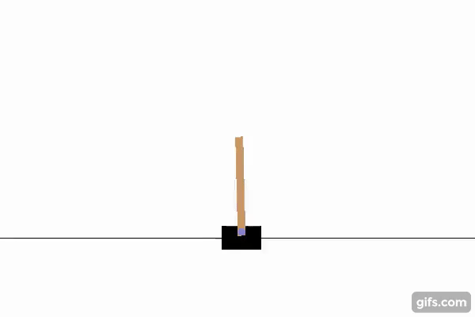
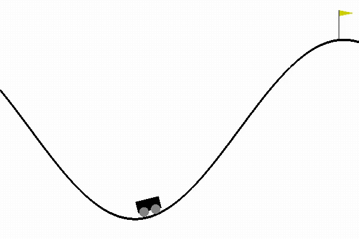
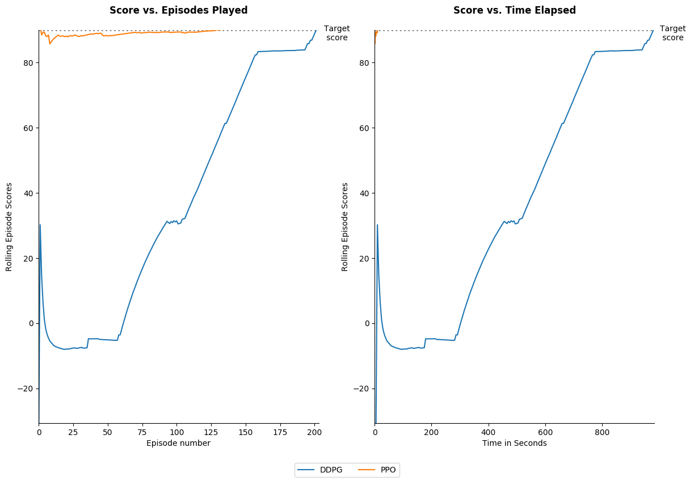
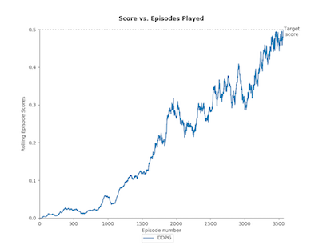
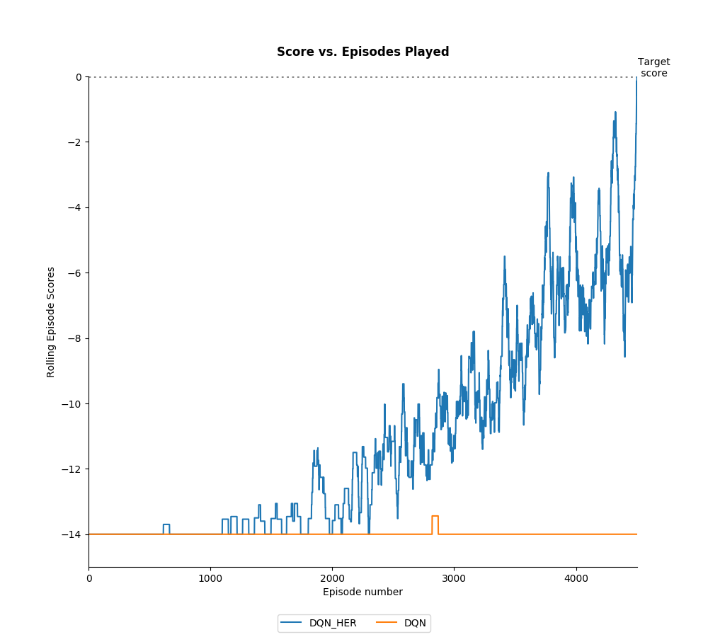
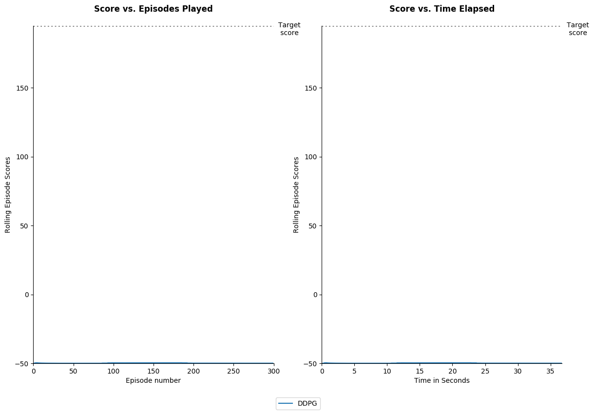

# Deep Reinforcement Learning Algorithms with PyTorch

   

This repository contains PyTorch implementations of deep reinforcement learning algorithms. 

## **Algorithms Implemented** 

1. Deep Q Learning (DQN) ([Mnih 2013](https://arxiv.org/pdf/1312.5602.pdf))  
1. DQN with Fixed Q Targets ([Mnih 2013](https://arxiv.org/pdf/1312.5602.pdf))
1. Double DQN ([Hado van Hasselt 2015](https://arxiv.org/pdf/1509.06461.pdf))
1. Double DQN with Prioritised Experience Replay ([Schaul 2016](https://arxiv.org/pdf/1511.05952.pdf))
1. REINFORCE ([Williams 1992](http://www-anw.cs.umass.edu/~barto/courses/cs687/williams92simple.pdf))
1. PPO ([Schulman 2017](https://openai-public.s3-us-west-2.amazonaws.com/blog/2017-07/ppo/ppo-arxiv.pdf))
1. DDPG ([Lillicrap 2016](https://arxiv.org/pdf/1509.02971.pdf)) 
1. Hill Climbing
1. Genetic Evolution
1. DQN with Hindsight Experience Replay (DQN-HER) ([Andrychowicz 2018](https://arxiv.org/pdf/1707.01495.pdf))
1. DDPG with Hindsight Experience Replay (DDPG-HER) ([Andrychowicz 2018](https://arxiv.org/pdf/1707.01495.pdf)) 

All implementations are able to quickly solve Cart Pole (discrete actions), Mountain Car Continuous (continuous actions), 
Bit Flipping (discrete actions with dynamic goals) or Fetch Reach (continuous actions with dynamic goals). I plan to add A2C, A3C and PPO-HER soon.


## **Results**

### a) Discrete Action Games 

#### Cart Pole:



Below shows the number of episodes taken and also time taken for each algorithm to achieve the solution score for the game Cart Pole. Because results can vary greatly each run, each agent plays the game 10 times and we show the *median* result. 
We show the results in terms of number of episodes taken to reach the required score
and also time taken. The algorithms were run on a 2017 Macbook Pro (no GPUs were used). The hyperparameters used are shown in the file `Results/Cart_Pole/Results.py`.   


### b) Continuous Action Games 

#### Mountain Car
  
  
  
Here are the results for DDPG with respect to the Mountain Car (Continuous) game. The hyperparameters used are shown in the file `Results/Mountain_Car_Continuous/Results.py`.





#### Tennis

The [Tennis](https://github.com/Unity-Technologies/ml-agents/blob/master/docs/Learning-Environment-Examples.md#tennis) environment is a multi-agent
cooperative environment where the goal of each agent is to hit the ball back to the other play as many times
 as possible without the ball going out of play or hitting the ground.  
<p align="center"></p>

A DDPG agent was used to solve the environment with the results below. The hyperparameters used can be found in `Results/Tennis/Results.py`:



### c) Hindsight Experience Replay (HER) Experiments

#### Bit Flipping 

Below shows the performance of DQN with and without Hindsight Experience Replay (HER) in the Bit Flipping Environment (14 bits) described
in the paper [Hindsight Experience Replay 2018](https://arxiv.org/pdf/1707.01495.pdf). The results replicate the result 
found in the paper and show that adding HER allowed the agent to solve a problem that vanilla DQN was not able
 to practically solve. The hyperparameters used were the same for both agents and the same as in the paper, they can be found in the file: `Results/Bit_Flipping/Results.py`    



#### Fetch Reach

Below shows the performance of DDPG with and without Hindsight Experience Replay in the Fetch Reach environment
which is introduced in this [Open AI blog post](https://blog.openai.com/ingredients-for-robotics-research/). The results
mirror those seen in paper [Multi-Goal Reinforcement Learning 2018](https://arxiv.org/pdf/1802.09464.pdf) and show that adding Hindsight Experience Replay
dramatically improved the ability of the agent to learn the task. The hyperparameters used were the same for both agents and the same as in the paper, they can be found 
in the file: `Results/Fetch_Reach/Results.py`




### Usage ###

The repository's high-level structure is:
 
    ├── Agents                    
        ├── Actor_Critic_Agents   
        ├── DQN_Agents         
        ├── Policy_Gradient_Agents
        └── Stochastic_Policy_Search_Agents 
    ├── Environments
        ├── Open_AI_Gym_Environments   
        ├── Other_Environments         
        └── Unity_Environments    
    ├── Results
        ├── Bit_Flipping_Environment   
        ├── Cart_Pole
        ├── Fetch_Reach
        ├── Mountain_Car_Continuous             
        └── Tennis        
    ├── Tests
    ├── Utilities
        ├── Data_Structures             
        └── Models            
   

#### i) To Watch the Agents Learn the Above Games  

To watch all the different agents learn the above games follow these steps:

```commandline
git clone https://github.com/p-christ/Deep_RL_Implementations.git
cd Deep_RL_Implementations

conda create --name myenvname
y
conda activate myenvname

pip3 install -r requirements.txt
export PYTHONPATH="${PYTHONPATH}:/Deep_RL_Implementations"
``` 

And then to watch them learn **Cart Pole** run:
`python Results/Cart_Pole/Results.py`

To watch them learn **Mountain Car** run: `python Results/Mountain_Car_Continuous/Results.py`

To watch them learn **Tennis** you will need to download the environment:

1. Linux: [click here](https://s3-us-west-1.amazonaws.com/udacity-drlnd/P3/Tennis/Tennis_Linux.zip)
1. Mac OSX: [click here](https://s3-us-west-1.amazonaws.com/udacity-drlnd/P3/Tennis/Tennis.app.zip)
1. Windows (32-bit): [click here](https://s3-us-west-1.amazonaws.com/udacity-drlnd/P3/Tennis/Tennis_Windows_x86.zip)
1. Windows (64-bit): [click here](https://s3-us-west-1.amazonaws.com/udacity-drlnd/P3/Tennis/Tennis_Windows_x86_64.zip)

and then run: `python Results/Tennis/Results.py`

To watch them learn **Bit Flipping** run: `python Results/Bit_Flipping/Results.py`

To watch them learn **Fetch Reach** run: `python Results/Fetch_Reach/Results.py`


#### ii) To Train the Agents on your Own Game  

To use the algorithms with your own particular game instead you follow these steps:
 
1. Create an Environment class to represent your game - the environment class you create should extend the `Base_Environment` class found in the `Environments` folder to make 
it compatible with all the agents.  

2. Create a config object with the hyperparameters and game you want to use. See `Results/Cart_Pole/Results.py` for an example of this.
3. Use function `run_games_for_agents` to have the different agents play the game. Again see `Results/Cart_Pole/Results.py` for an example of this.
