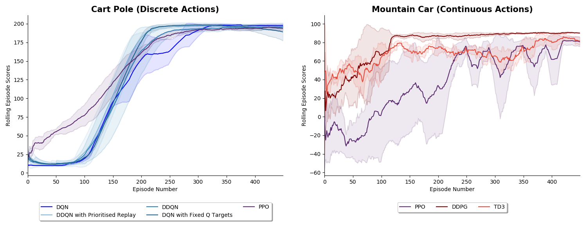

# Deep Reinforcement Learning Algorithms with PyTorch


   

This repository contains PyTorch implementations of deep reinforcement learning algorithms and environments. 

## **Algorithms Implemented** 

1. *Deep Q Learning (DQN)* ([Mnih et al. 2013](https://arxiv.org/pdf/1312.5602.pdf))  
1. *DQN with Fixed Q Targets* ([Mnih et al. 2013](https://arxiv.org/pdf/1312.5602.pdf))
1. *Double DQN* ([Hado van Hasselt et al. 2015](https://arxiv.org/pdf/1509.06461.pdf))
1. *Double DQN with Prioritised Experience Replay* ([Schaul et al. 2016](https://arxiv.org/pdf/1511.05952.pdf))
1. *REINFORCE* ([Williams et al. 1992](http://www-anw.cs.umass.edu/~barto/courses/cs687/williams92simple.pdf))
1. *DDPG* ([Lillicrap et al. 2016](https://arxiv.org/pdf/1509.02971.pdf)) 
1. *TD3* ([Fujimoto et al. 2018](https://arxiv.org/abs/1802.09477))
1. *A3C* ([Mnih et al. 2016](https://arxiv.org/pdf/1602.01783.pdf))
1. *PPO* ([Schulman et al. 2017](https://openai-public.s3-us-west-2.amazonaws.com/blog/2017-07/ppo/ppo-arxiv.pdf))
1. *DQN with Hindsight Experience Replay (DQN-HER)* ([Andrychowicz et al. 2018](https://arxiv.org/pdf/1707.01495.pdf))
1. *DDPG with Hindsight Experience Replay (DDPG-HER)* ([Andrychowicz et al. 2018](https://arxiv.org/pdf/1707.01495.pdf)) 
1. *Hierarchical-DQN (h-DQN)* ([Kulkarni et al. 2016](https://arxiv.org/pdf/1604.06057.pdf))
1. *Stochastic NNs for Hierarchical Reinforcement Learning (SNN-HRL)* ([Florensa et al. 2017](https://arxiv.org/pdf/1704.03012.pdf)) 

All implementations are able to quickly solve Cart Pole (discrete actions), Mountain Car Continuous (continuous actions), 
Bit Flipping (discrete actions with dynamic goals) or Fetch Reach (continuous actions with dynamic goals). I plan to add A2C, A3C, Soft Actor-Critic and hierarchical RL algorithms soon.

## **Environments Implemented**

1. *Bit Flipping Game* (as described in [Andrychowicz et al. 2018](https://arxiv.org/pdf/1707.01495.pdf))
1. *Four Rooms Game* (as described in [Sutton et al. 1998](http://www-anw.cs.umass.edu/~barto/courses/cs687/Sutton-Precup-Singh-AIJ99.pdf))
1. *Long Corridor Game* (as described in [Kulkarni et al. 2016](https://arxiv.org/pdf/1604.06057.pdf))

## **Results**

#### 1. Cart Pole and Mountain Car

Below shows various RL algorithms successfully learning discrete action game [Cart Pole](https://github.com/openai/gym/wiki/CartPole-v0)
 or continuous action game [Mountain Car](https://github.com/openai/gym/wiki/MountainCarContinuous-v0). The mean result from running the algorithms 
 with 3 random seeds is shown with the shaded area representing plus and minus 1 standard deviation. Hyperparameters
 used can be found in files `Results/Cart_Pole.py` and `Results/Mountain_Car.py`. 
 
 


#### 2. Hindsight Experience Replay (HER) Experiements

Below shows the performance of DQN and DDPG with and without Hindsight Experience Replay (HER) in the Bit Flipping (14 bits) 
and Fetch Reach environments described in the papers [Hindsight Experience Replay 2018](https://arxiv.org/pdf/1707.01495.pdf) 
and [Multi-Goal Reinforcement Learning 2018](https://arxiv.org/abs/1802.09464). The results replicate the results found in 
the papers and show how adding HER can allow an agent to solve problems that it otherwise would not be able to solve at all. Note that the same hyperparameters were used within each pair of agents and so the only difference 
between them was whether hindsight was used or not. 


#### 3. Hierarchical Reinforcement Learning Experiments

The results on the left below show the performance of DQN and the algorithm hierarchical-DQN from [Kulkarni et al. 2016](https://arxiv.org/pdf/1604.06057.pdf)
on the Long Corridor environment also explained in [Kulkarni et al. 2016](https://arxiv.org/pdf/1604.06057.pdf). The environment
requires the agent to go to the end of a corridor before coming back in order to receive a larger reward. This delayed 
gratification and the aliasing of states makes it a somewhat impossible game for DQN to learn but if we introduce a 
meta-controller (as in h-DQN) which directs a lower-level controller how to behave we are able to make more progress. This 
aligns with the results found in the paper. 

The results on the right show the performance of DDQN and algorithm Stochastic NNs for Hierarchical Reinforcement Learning 
(SNN-HRL) from [Florensa et al. 2017](https://arxiv.org/pdf/1704.03012.pdf). DDQN is used as the comparison because
the implementation of SSN-HRL uses 2 DDQN algorithms within it. Note that the first 300 episodes of training
for SNN-HRL were used for pre-training which is why there is no reward for those episodes. 
 

     

### Usage ###

The repository's high-level structure is:
 
    ├── Agents                    
        ├── Actor_Critic_Agents   
        ├── DQN_Agents         
        ├── Policy_Gradient_Agents
        └── Stochastic_Policy_Search_Agents 
    ├── Environments   
    ├── Results             
        └── Data_and_Graphs        
    ├── Tests
    ├── Utilities             
        └── Data Structures            
   

#### i) To watch the agents learn the above games  

To watch all the different agents learn Cart Pole follow these steps:

```commandline
git clone https://github.com/p-christ/Deep_RL_Implementations.git
cd Deep_RL_Implementations

conda create --name myenvname
y
conda activate myenvname

pip3 install -r requirements.txt
export PYTHONPATH="${PYTHONPATH}:/Deep_RL_Implementations"

python Results/Cart_Pole.py
``` 

For other games change the last line to one of the other files in the Results folder.

#### ii) To train the agents on another game  

Most Open AI gym environments should work. All you would need to do is change the config.environment field (look at `Results/Cart_Pole.py`  for an example of this). 

You can also play with your own custom game if you create a separate class that inherits from gym.Env. See `Environments/Four_Rooms_Environment.py`
for an example of a custom environment and then see the script `Results/Four_Rooms.py` to see how to have agents play the environment.